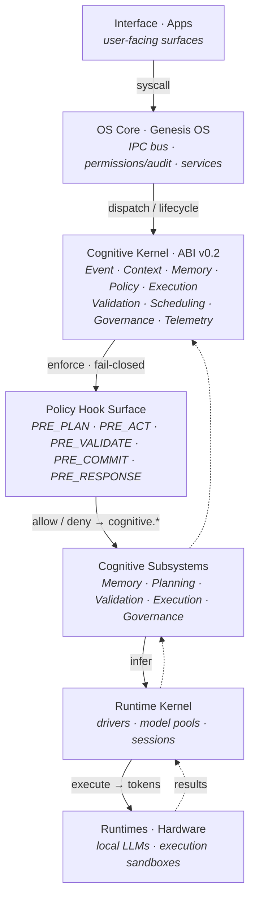

# Genesis OS — Cognitive Agent Architecture Blueprint

> A reusable blueprint for building **multi-agent cognitive systems whose capability
> never outruns their accountability.**
>
> Not a framework you `pip install` and forget — a *set of architectural contracts*
> (a kernel ABI, a fail-closed policy surface, a swappable provider model, and an
> honesty-first evaluation loop) plus a small **runnable reference implementation** you
> can read in an afternoon and adapt to your own stack.

<p>
  
  
  
</p>

---

## Why this exists

Most agent frameworks optimize for *capability*: more tools, longer context, more
autonomy. That is the easy half. The hard half — the half that decides whether a
system is trustworthy across years and across model upgrades — is **accountability**:

- Can the system tell the truth about what it did, or only what it *claims* it did?
- When it is wrong, does it change its mind — and can you trace *why* a belief changed?
- When you swap the underlying model for a stronger one, does the governance get
  **tighter** automatically, or does it quietly fall away because "the model is smart now"?

This blueprint is an answer to those questions. Its load-bearing law is one sentence:

> **Capability must never outrun accountability.**

Everything below is a mechanism that makes that law testable rather than aspirational.

---

## The architecture at a glance

The system is a **layered cognitive OS**. Each layer only talks to its neighbours through
a defined contract, so any layer can be replaced without rewriting the others.



Four ideas do the real work, and each has its own document and its own reference code:

| Idea | One-line | Doc | Code |
|---|---|---|---|
| **Cognitive Kernel ABI** | Subsystems are plugins that conform to a stable binary-ish interface; the kernel owns the token budget, the event spine, and the lifecycle. | [docs/02](docs/02-cognitive-kernel-abi.md) | [`genesis_kernel/kernel.py`](reference/genesis_kernel/kernel.py) |
| **Policy Hook Surface** | Fail-closed policy checks at every lifecycle point (`PRE_PLAN … PRE_RESPONSE`); most-restrictive-wins; every decision audited. | [docs/03](docs/03-policy-hook-surface.md) | [`genesis_kernel/hooks.py`](reference/genesis_kernel/hooks.py) |
| **Capability Provider model** | The model/GPU/human is a *swappable provider of a capability*, not a hard-wired dependency. Architecture governs; resources participate. | [docs/04](docs/04-capability-provider-model.md) | [`genesis_kernel/providers.py`](reference/genesis_kernel/providers.py) |
| **Reality Grading Loop** | A mission stakes a falsifiable *hypothesis*, graded against **evidence** (filesystem/ledger), never the model's own claim of success. | [docs/05](docs/05-reality-grading-loop.md) | [`genesis_kernel/reality_grading.py`](reference/genesis_kernel/reality_grading.py) |

And one idea holds them together: **[Governance & the Constitution](docs/06-governance-and-constitution.md)** —
the rules amend only by ceremony (an agent may *propose*, only the human *ratifies*), and
CI-style tripwires make architectural drift structurally illegal rather than merely discouraged.

---

## Run the reference in 30 seconds

The reference implementation has **zero third-party dependencies** — standard library only.

```bash
cd reference
python examples/run_mission.py     # runs one mission end-to-end through the whole stack
python -m tests.test_kernel        # or: python tests/test_kernel.py  → deterministic checks
```

`run_mission.py` walks a single mission through **plan → act → validate → commit → respond**,
shows the Policy Hook Surface allowing/denying each step (including a deliberately blocked
fabrication attempt), stakes a hypothesis, and grades it against simulated reality — printing
the full audit trace. That trace *is* the point: you can see exactly why every decision was made.

---

## How to use this blueprint

1. **Read [docs/00-overview.md](docs/00-overview.md)** — the 10-minute tour.
2. **Steal the contracts, not the code.** The value is in [`specs/`](specs/) — the Kernel ABI,
   the Policy Hook contract, the Capability contract. Implement them in your language of choice.
3. **Keep the reference as your conformance oracle.** When your implementation disagrees with the
   reference on a lifecycle or fail-closed question, the reference is the tie-breaker.
4. **Record your own decisions as ADRs.** Copy [`adr/ADR-TEMPLATE.md`](adr/ADR-TEMPLATE.md); the
   three seed ADRs show the house style.
5. **Adopt the disciplines deliberately.** They are worth more as your models get stronger, not less.

---

## What this blueprint is *not*

- **Not a prompt library or an agent “persona” pack.** It is structural.
- **Not tied to any model vendor.** The whole point of the Capability Provider model is that the
  provider is swappable; the reference ships with a deterministic offline provider so the demo
  needs no API key.
- **Not a claim of AGI, safety guarantees, or production-readiness.** It is a *reference* — a
  disciplined starting point. See the warranty disclaimer in [LICENSE](LICENSE).

---

## Repository layout

```
.
├── README.md                  ← you are here
├── LICENSE  · NOTICE          ← Apache-2.0
├── docs/                      ← the architecture, one concept per file
│   ├── 00-overview.md
│   ├── 01-layered-architecture.md
│   ├── 02-cognitive-kernel-abi.md
│   ├── 03-policy-hook-surface.md
│   ├── 04-capability-provider-model.md
│   ├── 05-reality-grading-loop.md
│   ├── 06-governance-and-constitution.md
│   └── 07-glossary.md
├── specs/                     ← the contracts, framework-agnostic
│   ├── kernel-abi.md
│   ├── policy-hook-contract.md
│   └── capability-contract.md
├── adr/                       ← architecture decision records + template
└── reference/                 ← runnable, dependency-free Python reference
    ├── genesis_kernel/        ← kernel, hooks, providers, reality grading, subsystems
    ├── examples/run_mission.py
    └── tests/test_kernel.py
```

---

## License & attribution

Released under the **[Apache License 2.0](LICENSE)**. You may use, modify, and redistribute it,
including commercially, provided you keep the license and [NOTICE](NOTICE). Contributions are
accepted under the same license — see [CONTRIBUTING.md](CONTRIBUTING.md).

Co-designed in a human + AI partnership under Genesis Mind. If it helps you build an agent
system that is *powerful and corrigible and honest*, with the human holding the amendment pen,
it has done its job.
