# 01 · Layered Architecture

The system is an operating system for cognition. Like any OS it is built in layers, and the
value of the design is in the **contracts between layers**, not in any single component. Replace
a layer, honour its contract, and the rest of the system does not notice.

## The seven layers

```mermaid
flowchart TB
    subgraph L1["① Interface · Apps"]
        UI["Continental UI<br/>chat · council · intel"]
    end
    subgraph L2["② OS Core · Genesis OS"]
        BUS["IPC Event Bus"]
        PERM["Permissions · Audit"]
        WS["Workspace (sandboxed FS)"]
        PKG["Package Mgr"]
        SVC["Runtime / Workflow / Memory / Monitoring / Scheduler services"]
    end
    subgraph L3["③ Cognitive Kernel · ABI v0.2"]
        EV["Event"]; CX["Context"]; MEM["Memory"]; POL["Policy"]; EXE["Execution"]
        VAL["Validation"]; SCH["Scheduling"]; GOV["Governance"]; TEL["Telemetry"]
    end
    subgraph L4["④ Policy Hook Surface"]
        H1["PRE_PLAN"]; H2["PRE_ACT"]; H3["PRE_VALIDATE"]; H4["PRE_COMMIT"]; H5["PRE_RESPONSE"]
    end
    subgraph L5["⑤ Cognitive Subsystems"]
        S1["Memory ★"]; S2["Planning ★"]; S3["Validation ★"]; S4["Execution ★"]; S5["Governance ★"]
    end
    subgraph L6["⑥ Runtime Kernel"]
        DRV["drivers"]; POOL["model pools"]; SESS["sessions"]
    end
    subgraph L7["⑦ Runtimes · Hardware"]
        OLL["local LLMs"]; SBX["execution sandbox"]
    end

    L1 -->|syscall| L2 -->|dispatch| L3 -->|enforce| L4 -->|allow/deny| L5 -->|infer| L6 -->|execute| L7
```

> ★ = conforms to the Kernel ABI.

### ① Interface · Apps — *user-facing surfaces*
Where humans meet the system: chat, a council/deliberation view, dashboards. This layer holds
**no cognition and no authority**. It issues *syscalls* down into the OS Core and renders what
comes back. You can have many interfaces (CLI, web, a bot) over the same core.

**Contract:** may only call OS Core syscalls. Never reaches into the kernel or a model directly.

### ② OS Core · Genesis OS — *IPC, permissions, service manager*
The operating-system layer. It provides:
- an **IPC Event Bus** (publish/subscribe topics; the nervous system),
- **Permissions · Audit** (who may do what; every grant/denial recorded),
- a sandboxed **Workspace** (the only filesystem an agent may touch),
- a **Package Manager** (installs skills/apps),
- and long-lived **Services** (runtime, workflow, memory, monitoring, scheduler).

**Contract:** exposes a stable syscall/service surface upward; dispatches cognitive work
downward into the kernel. Owns *side effects on the outside world* (files, network, processes).

### ③ Cognitive Kernel · ABI v0.2 — *the cognitive quality gate*
The heart of the design, detailed in [§02](02-cognitive-kernel-abi.md). Nine kernel services —
**Event, Context, Memory, Policy, Execution, Validation, Scheduling, Governance, Telemetry** —
provide the lifecycle and the guarantees (budget never overflows, every act is policed, every
record is emitted). Subsystems plug in through the **ABI**.

**Contract:** everything below the kernel is reached *through* the kernel; nothing skips it.

### ④ Policy Hook Surface — *fail-closed, every decision audited*
Detailed in [§03](03-policy-hook-surface.md). A row of lifecycle hooks — `PRE_PLAN`, `PRE_ACT`,
`PRE_VALIDATE`, `PRE_COMMIT`, `PRE_RESPONSE` — where policies vote allow/deny before the
corresponding cognitive step runs. **Most-restrictive-wins.**

**Contract:** no cognitive step (§⑤) runs until its preceding hook returns *allow*. An error is a
*deny*, never an *allow*.

### ⑤ Cognitive Subsystems — *the thinking parts*
The agent's mind, decomposed into single-responsibility subsystems that each **conform to the
Kernel ABI**: **Memory** (recall/persist), **Planning** (decompose goal → steps), **Validation**
(the reference quality gate), **Execution** (does the act, behind `PRE_ACT`), **Governance**
(deliberation + policy authoring). A subsystem that does not conform to the ABI does not load.

**Contract:** a subsystem receives an `Event` + `Context` and returns an `Event` or `None`. It
may not perform outside side effects directly — it asks the kernel, which asks the OS Core.

### ⑥ Runtime Kernel — *drivers, model pools, sessions*
The bridge between cognition and raw compute. It manages **drivers** (adapters to specific model
runtimes), **model pools** (which models are loaded and how they are tiered), and **sessions**.
This is where a *Capability Provider* ([§04](04-capability-provider-model.md)) is actually bound
to a model.

**Contract:** exposes "give me capability X for this request" upward; manages hardware downward.

### ⑦ Runtimes · Hardware — *where tokens are actually spent*
Local LLM runtimes, execution sandboxes, GPUs/CPUs. The physical floor. Deliberately the *thinnest*
layer of authority: it computes, it does not decide.

**Contract:** executes a bound request; returns tokens/results. Holds no policy.

## Why layer it this way?

**Replaceability.** Each boundary is a seam you can cut:
- Swap **①** to add a new front-end without touching cognition.
- Swap **⑦/⑥** to move from a local 7B model to a frontier API — the layers above are unchanged
  because they depend on the *Capability Provider contract*, not on a model.
- Add a **⑤** subsystem (say, a "Research" capability) by conforming to the ABI; the kernel routes
  to it automatically.

**Containment.** Authority *decreases* as you go down. The Interface has none; the OS Core owns
side effects but only through audited permissions; the hardware just computes. An exploit or a
hallucination low in the stack cannot escalate, because the layer above it gates every step.

**Auditability.** Because everything crosses the kernel and the policy surface, there is a single
place where the story of "what the system did and why" is written. See
[§05 Reality Grading](05-reality-grading-loop.md) and
[§06 Governance](06-governance-and-constitution.md).

## Migration is first-class

The layers carry an explicit **conformance status** — in the live system, subsystems are marked
`migrated (conforms to ABI ✓)`, `live (legacy)`, or `planned (spec)`. This makes the architecture
honest about itself: you can see, at a glance, how much of the running system actually obeys the
current contract versus how much is legacy still being pulled in behind a strangler-fig migration.
A blueprint that pretends it is already finished is not a blueprint; it is marketing.

→ Next: [§02 Cognitive Kernel ABI](02-cognitive-kernel-abi.md)
