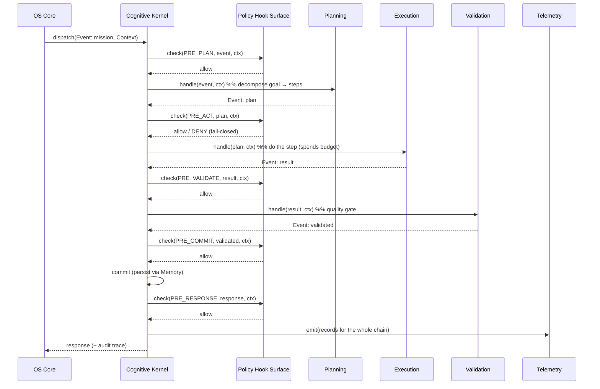

# 02 · The Cognitive Kernel & its ABI

An operating-system kernel arbitrates access to scarce, dangerous resources (CPU, memory, I/O) on
behalf of processes that cannot be trusted to share them politely. The **Cognitive Kernel** does
the same for cognition. The scarce, dangerous resources are: the **context/token budget**, the
right to **take an action in the world**, and the **shared memory of what is true**. The
untrusted processes are the cognitive subsystems (and, ultimately, the model behind them).

## What the kernel guarantees

1. **The budget never overflows.** The kernel owns the token budget for a run. A subsystem cannot
   silently blow the model's context window, because it must *spend* from the kernel's budget and
   the kernel refuses an over-spend. (Real models have a hard ceiling — e.g. 16k tokens — and a
   single over-budget step fails *every* subsequent call. The kernel makes that failure explicit
   and early, not mysterious and late.)
2. **Nothing acts unpoliced.** Every lifecycle step is preceded by a Policy Hook (§03). The kernel
   will not run a step whose hook denied it.
3. **Every step is recorded.** The kernel emits Telemetry for each event, decision, and outcome.
   Absence of a record is itself a detectable fault.
4. **Only conforming subsystems load.** A subsystem must declare the ABI version it conforms to.
   Mismatch → it does not register. No "mostly compatible."

## The nine kernel services

These are the kernel's internal faculties. Think of them as the syscall table of the mind.

| Service | Responsibility | Analogy (classic OS) |
|---|---|---|
| **Event** | The envelope and the two-tier audit spine; the authority for "what happened." | interrupt/message passing |
| **Context** | Owns the token budget; guarantees never-overflow; carries the working set. | virtual memory manager |
| **Memory** | Recall/persist over the durable store (the vault / provenance graph). | filesystem cache |
| **Policy** | Evaluates the hook surface at each lifecycle point (the Constitution in force). | reference monitor |
| **Execution** | Guards the act — fail-closed, idempotent where possible. | syscall dispatch to I/O |
| **Validation** | The cognitive quality gate; is the work actually correct? | fsck / integrity check |
| **Scheduling** | Routes work (chat / mission / council) to the right subsystem + provider. | process scheduler |
| **Governance** | Deliberation council, ADR gate, amendment/escalation. | init + policy daemon |
| **Telemetry** | "Explain" records, the Outcome Clock, evaluation hooks. | logging / tracing |

## The ABI: what a subsystem must implement

The ABI (Application *Binary-ish* Interface — it is a stable structural contract, not literally
machine code) is deliberately tiny, because a small contract is a contract people actually keep.

A subsystem is anything that satisfies:

```text
Subsystem:
    name        : str                      # unique identity
    abi_version : str                      # e.g. "0.2" — must match the kernel's
    provides    : list[Capability]         # what cognitive capabilities it offers
    handle(event: Event, ctx: Context) -> Event | None
    conforms_to(abi_version: str) -> bool  # gate at registration time
```

That is the entire surface. `handle` is a pure-ish function of an incoming `Event` and the current
`Context`; it returns the next `Event` (to continue the lifecycle) or `None` (done). Everything a
subsystem is allowed to do — recall memory, spend budget, request an action — it does *through the
`Context` and by emitting events*, never by reaching outside the kernel.

See the formal version in [`specs/kernel-abi.md`](../specs/kernel-abi.md) and the working code in
[`reference/genesis_kernel/abi.py`](../reference/genesis_kernel/abi.py).

### Why "conforms_to" is a hard gate, not a warning

The single most corrosive thing in a long-lived system is the "mostly works" plugin — the one that
almost honours the contract, so it loads, and then violates an invariant three months later in
production. Making conformance a **load-time gate** (mismatch → refuse to register) converts a
future runtime mystery into a present, obvious startup error. The blueprint would rather fail
loudly at boot than lie quietly at runtime.

## The lifecycle: how a request flows through the kernel



Every arrow into `H` is a place the system can say **no**, and every step emits to `T`. That is the
kernel's whole job: make the mind's lifecycle *interruptible by policy* and *legible after the fact.*

## Context: the budget is a first-class citizen

Most agent bugs at the boundary are really budget bugs — a prompt that quietly grew past the model's
ceiling, so the next tool call fails for reasons that look unrelated. The kernel refuses to let
budget be implicit:

```text
Context.spend(n_tokens):
    if used + n > budget:  raise BudgetExceeded   # early, explicit, attributable
    used += n
```

A subsystem that wants to do something expensive must ask, and can be told no *before* it corrupts
the run. In the reference, this is why a mission with too many tools loaded fails cleanly at
`PRE_PLAN` with a budget reason, instead of dying three steps later with a confusing model error.

→ Next: [§03 Policy Hook Surface](03-policy-hook-surface.md)
