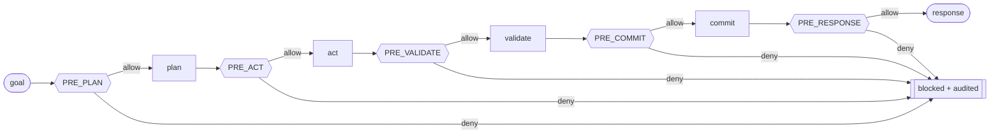

# 03 · The Policy Hook Surface

This is where "capability must not outrun accountability" stops being a slogan and becomes an
`if` statement that can return **deny**.

## The idea

Between the intent to do something and the doing of it, the system inserts a **hook** — a named
point where policies get to vote. If any policy denies, the step does not run. The hooks sit at
the seams of the cognitive lifecycle:

| Hook | Fires before… | Typical policy concern |
|---|---|---|
| `PRE_PLAN` | the agent decomposes a goal into steps | budget sanity, mandate scope, forbidden goals |
| `PRE_ACT` | the agent takes an action with outside effect | shadow-fabrication guard, tool allow-lists, irreversibility |
| `PRE_VALIDATE` | the work is checked for correctness | which quality gate applies, evidence requirements |
| `PRE_COMMIT` | results are persisted / made durable | provenance completeness, no unsourced beliefs |
| `PRE_RESPONSE` | anything is surfaced to the human | disclosure, safety, "don't claim what you can't show" |



## The three invariants (non-negotiable)

### 1. Most-restrictive-wins
Multiple policies may be registered at a hook. The result is **deny if any policy denies.** There
is no "majority vote," no "the important policy wins." A single deny is final. This makes adding a
new safety policy *monotonic*: a new policy can only ever make the system more careful, never less.

### 2. Fail-closed
If a policy raises an error, throws, times out, or cannot reach the data it needs to decide — the
result is **deny**, not allow. The absence of a clear "yes" is a "no." This is the opposite of
most software's instinct (fail-open, "let it through so the feature works"), and it is deliberate:
a policy engine that fails open is security theatre.

### 3. Every decision is audited
Each evaluation — the hook, the policy name, allow/deny, and the reason — is written to the audit
log *whether it allowed or denied.* You can later ask "why did the system do X?" and "why did the
system *refuse* Y?" and get an answer with names attached. A decision with no record is treated as
a fault in the system, not as a silent success.

See the exact contract in [`specs/policy-hook-contract.md`](../specs/policy-hook-contract.md) and
the implementation in [`reference/genesis_kernel/hooks.py`](../reference/genesis_kernel/hooks.py).

## A policy, concretely

A policy is small: a name, the hook it attaches to, and an `evaluate` that returns a `Decision`.

```text
Policy:
    name  : str
    point : HookPoint
    evaluate(event, ctx) -> Decision(allow: bool, reason: str, policy: str)
```

The reference ships several worked examples, including:

- **`gps2` (governance) at `PRE_PLAN`** — refuses to plan a goal that exceeds the run's budget or
  falls outside the declared mandate. This is the guard that turns a would-be silent 16k overflow
  into an explicit, early "no, this goal doesn't fit."
- **`shadow.fabrication` at `PRE_ACT`** — refuses an action whose declared intent is to *invent*
  evidence (fabricate a search result, forge a file's provenance). This is the mechanical form of
  "never fabricate": the system cannot take a fabrication action because the hook denies it.
- **`cvl.quality_gate` at `PRE_VALIDATE`** — routes to the correct validation subsystem and
  requires that validation actually ran before results may be committed.
- **`guidance.g1` / `warrant.cee_c1` at `PRE_COMMIT`** — refuses to persist a belief that has no
  provenance (no chain back to the evidence that produced it).

## Why hooks instead of "just be careful in the code"?

Because *careful code does not compose.* If safety lives as scattered `if` checks inside each
subsystem, then every new subsystem is a new place to forget a check, and there is no single
audit of what the system is allowed to do. Hooks centralise the *decision surface*:

- **One place to reason about authority.** You can read the registered policies and know, without
  reading every subsystem, what the system will and won't do.
- **Separation of powers.** The subsystem that *wants* to act (Execution) is not the one that
  *decides* whether it may (Policy). The actor never grades its own permission slip.
- **Additive safety.** Tightening the system means registering a policy, not editing N subsystems.

## The relationship to the human

The Policy Hook Surface enforces the *current* rules. It does not get to change them. **Which**
policies are registered, and what they say, is set by the Constitution — and the Constitution
amends only by ceremony, with the human holding the pen. That is the subject of
[§06 Governance](06-governance-and-constitution.md). The hook surface is the *executive*; the
Constitution is the *legislature*; the human is the sovereign who ratifies.

→ Next: [§04 Capability Provider Model](04-capability-provider-model.md)
