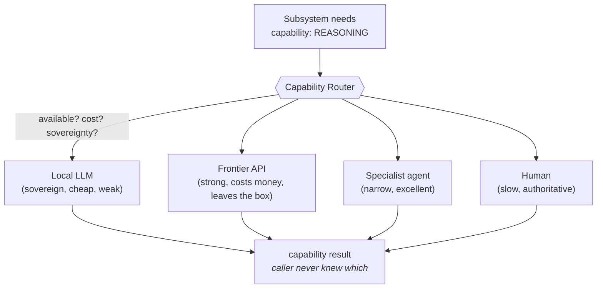

# 04 · The Capability Provider Model

> **Architecture governs. Resources participate.**

This is the idea that lets the system outlive any single model. It is the same move as the search
Provider Layer, or a database driver, or an OS device driver — generalised to *cognition itself*.

## The reframe

A naïve agent is built *around a model*: prompts, parsing, and control flow are all shaped to one
model's quirks. When the model changes, the agent breaks. The system's identity is fused to a
vendor.

This architecture inverts it. The system is built around **capabilities it needs** —

- `REASONING` — draw a conclusion from premises
- `PLANNING` — decompose a goal into ordered steps
- `MEMORY` — recall/persist durable knowledge
- `EXECUTION` — carry out a step with an outside effect
- `VALIDATION` — judge whether work is correct
- `GOVERNANCE` — deliberate and author policy

— and a **Capability Provider** is *anything that can supply one of them.* A local 7B model, a
frontier API, a specialised fine-tune, a deterministic rule engine, a *human* — all are providers.
The system asks for `REASONING`; the router hands back *a* provider; the rest of the stack never
learns which one answered.



The formal contract is in [`specs/capability-contract.md`](../specs/capability-contract.md); the
code is [`reference/genesis_kernel/providers.py`](../reference/genesis_kernel/providers.py).

## The provider contract

```text
CapabilityProvider:
    name      : str
    provides  : list[Capability]
    available() -> bool                       # gate: has key? has GPU? is the human awake?
    invoke(capability, request) -> Result     # do the thing
```

`available()` is the crucial method. A provider that lacks its API key, or whose GPU is busy, or
whose human is asleep, returns `available() = False` and is **silently skipped** — not errored.
This is exactly the pattern the reference search Provider Layer uses: keyed providers first when
configured, free providers as fallback, and with nothing configured the behaviour is unchanged.

## The router's job: negotiation, not just selection

Picking a provider is a small optimisation problem over a few axes:

| Axis | Question | Example consequence |
|---|---|---|
| **Availability** | Is the provider up and configured? | no key → skip, don't fail |
| **Capability fit** | Can it actually do this capability well enough? | long-reasoning → local model may not qualify |
| **Cost** | Tokens, dollars, latency. | prefer local for cheap/light work |
| **Sovereignty** | May this data leave the box at all? | `sovereign=true` → local-only, cloud is *blocked* not just dispreferred |
| **Determinism** | Do we need a stable, reproducible answer? | grading path prefers deterministic providers |

The router applies these in a fixed, inspectable order and records why it chose what it chose.
Determinism of *the routing* matters as much as the result: two identical requests should route
the same way, or your audit trail is fiction.

## The provider evaluation matrix (a worked example)

A useful artefact to keep alongside the router is a plain table of *which provider mode can carry
which kind of work* — filled in from evidence, not vibes:

| Mission type | Local | Cloud | Hybrid | Sovereign (local-only) |
|---|---|---|---|---|
| Light read-only audit | ✓ | ✓ | ✓ | ✓ |
| Heavy planning / meta | ✗ (context + weak planning) | ✓ | ✓ | ✗ |
| Tool-heavy multi-step | ~ | ✓ | ✓ | ~ |
| Deep long reasoning | ✗ | ✓ | ✓ | ✗ |

The reading is honest: a weak local provider is *sufficient* for light, sovereign work and
*insufficient* for heavy reasoning — so the lever for hard work is a stronger provider, chosen
per-mission, without changing a line of the subsystems above.

## Why this is the key to longevity

Three payoffs, each load-bearing:

1. **Model independence.** A frontier model is a *provider upgrade*, not a rewrite. The stack
   levels up by swapping who answers `REASONING`, and everything above is untouched.
2. **Graceful degradation.** Offline, keyless, or GPU-starved, the system falls back to whatever
   provider *is* available rather than failing outright. (Its capability drops honestly; it does
   not pretend.)
3. **Heterogeneous minds.** "Provider" is not restricted to LLMs. A CSP solver can be the provider
   for a `PLANNING` sub-problem; a human is the provider for a high-stakes `GOVERNANCE` decision.
   The architecture treats *human-in-the-loop as just another provider of a capability* — which is
   exactly how you keep a human in authority as the machine gets stronger.

## The danger, named

The Capability Provider model is what makes it *tempting* to drop the governance when you plug in a
strong model — "it's smart now, we don't need the grading/ceremony." **That is the one trap that
unravels the whole design.** The provider is the replaceable part; the discipline is not. As the
provider strengthens, the Policy Hook Surface (§03) and the Reality Grading Loop (§05) matter
*more*, because a stronger provider can do more damage per unpoliced action. Swap providers freely;
never swap out accountability.

→ Next: [§05 Reality Grading Loop](05-reality-grading-loop.md)
