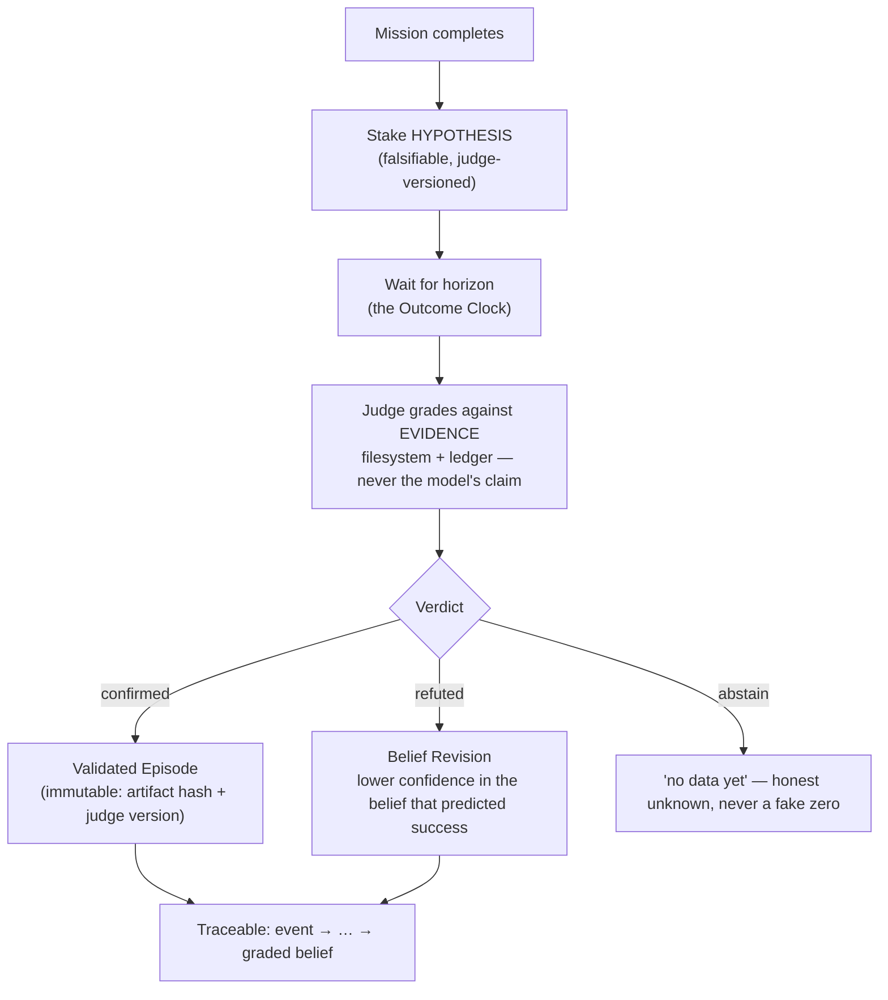

# 05 · The Reality Grading Loop

> A system that grades its own homework learns to write confident nonsense. This loop takes the
> red pen out of the model's hands and gives it to reality.

## The problem it solves

When an agent finishes a mission, how do you know it *succeeded*? The tempting answer is "it said
it did." That answer is poison. A model optimising to *look* successful will report success; a
model optimising to *be* honest will sometimes report "I failed." If your loop rewards the
self-report, you are training the first kind of system. This loop is built so the system can only
be rewarded for outcomes that **reality confirms.**

## The core move: stake a falsifiable hypothesis

A finished mission does not emit "success." It emits a **hypothesis** — a concrete, checkable
prediction about the state of the world:

> `pr_8233e7f`: "The audit report exists at `docs/audit/adr-0014.md`, contains a section
> 'Findings', and is ≥ 2 KB." — judge `rg-1`, staked at `T`, horizon `T+7d`.

Notice what this is *not*: it is not "the mission went well." It is a statement that can be
**proven false by looking.** That is the whole trick. Vague claims cannot be graded; hypotheses
can.

## The core discipline: Evidence Normalization

> **A provider's assertion is not evidence. Evidence is what the filesystem and the ledger say.**

The judge never reads the model's claim. It reads *reality*:

- Does the file exist? (filesystem)
- Does it have the claimed properties? (hash, size, content)
- Do the ledger/audit records corroborate it? (the event journal)

The model's "I created the report" is treated as a *hypothesis to be checked*, with exactly the
same suspicion as any other unverified claim. This is the mechanism behind "never fabricate": a
fabricated result cannot survive grading, because grading looks past the claim to the evidence.

## The loop

### 1. Stake
At completion, the mission records a hypothesis with: the statement, the *evidence query* that
will check it, the **judge version** in force at stake time, and a horizon (when to grade). The
judge version is pinned *now* so that changing the judge later cannot retroactively rewrite
history.

### 2. Wait — the Outcome Clock
Grading is not instantaneous. Some hypotheses ("this fix reduces error rate") only become checkable
after time passes. An **Outcome Clock** fires at the horizon and triggers grading with **zero human
intervention** — which is itself one of the things the first evidence review measures.

### 3. Grade against evidence
The versioned judge (`rg-1`, `rg-2`, …) runs the evidence query and returns one of:
- **confirmed** — reality matches the hypothesis,
- **refuted** — reality contradicts it,
- **abstain** — not enough data to decide (rendered as an honest "no data yet," *never* a fake 0).

### 4. Consequence
- **confirmed** → a **Validated Episode** is written, carrying *immutable evidence*: the artifact
  hash and the judge version at stake time. It cannot be quietly edited later.
- **refuted** → a **Belief Revision**: the belief that predicted success has its confidence
  lowered, attributed to `Reality (outcome)`. The system changed its mind because reality
  disagreed — corrigibility, mechanised.

### 5. Trace
Every graded belief is reachable backward to the events that produced it (forward and reverse
trace over the provenance graph). "Why does the system believe X?" always has an evidenced answer.

See [`reference/genesis_kernel/reality_grading.py`](../reference/genesis_kernel/reality_grading.py).

## Versioned judges, and why the version is sacred

The judge *will* get smarter. Today it may grade by mere existence (`rg-1`: does the file exist?);
tomorrow by content quality (`rg-2`). That is fine — but two rules protect the integrity of the
record:

1. **The judge version is pinned into each hypothesis at stake time.** A hypothesis staked under
   `rg-1` is always a fact about what `rg-1` would say. History is immutable.
2. **A judge upgrade carries a Migration Note, never a bare version bump.** Changing how reality is
   graded is a governed act (it can silently rewrite what counts as "success"), so it goes through
   the Constitution's ceremony, not a quiet commit.

## The honesty dividend (a real example)

In the reference lineage, the first live mission *failed three times before it succeeded.* The
important part is what it did on those three failures: it staked **zero** hypotheses. The system
refused to claim a success it did not have. The eventual completion was nice; the three honest
failures were the real victory — they are the proof that the loop optimises for *telling the truth*
rather than *looking good.* A benchmark measures whether the system is clever. This loop measures
whether the system is honest. The second property is the one that compounds over years.

## Relationship to the rest of the stack

- The **Policy Hook Surface** (§03) stops bad actions *before* they happen (`PRE_ACT`
  fabrication guard). The Reality Grading Loop catches *false claims of success* after the fact.
  Together they cover both halves of "don't do wrong / don't lie about it."
- **Governance** (§06) owns the judge: who may change it, and by what ceremony.
- **Telemetry** (the kernel's ninth service) is where the Outcome Clock and Explain records live.

→ Next: [§06 Governance & the Constitution](06-governance-and-constitution.md)
