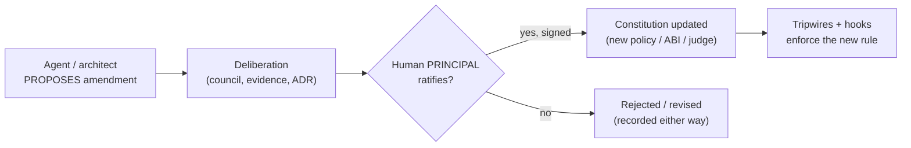

# 06 · Governance & the Constitution

The previous chapters build a system that *acts under rules* (§03) and *tells the truth about
outcomes* (§05). This chapter answers the last question: **who governs the rules themselves, and
how are they allowed to change?** A safety mechanism that its own makers can quietly edit protects
nothing. So the final discipline is that governance must bind even the powerful — including the
architect and the agent.

## The Constitution

The system's rules live in a **Constitution**: the registered policies (§03), the Kernel ABI
version, the active judge, the ownership rules for state, and the standing orders. It is a
document *and* a set of enforced invariants — the parts that can be checked are checked (see
Tripwires below), and the parts that require judgement go through ceremony.

## The amendment ceremony

> **An agent may propose. Only the human principal may ratify.**

This single asymmetry is the backbone of human authority. The agent is not forbidden from
improving the rules — it is *expected* to propose amendments, draft ADRs, argue with evidence. But
the pen that actually changes the Constitution stays in the human's hand.



Properties that make this real rather than decorative:

- **Multi-party, signed, append-only.** An amendment is a recorded, attributed act, not a silent
  code change. You can read the history of *why the rules are what they are.*
- **The proposal itself is disciplined.** Even a document that transmits the founding values enters
  "proposed, pending ceremony" — it does not self-ratify. Beginning by breaking your own rule
  betrays the rule.
- **Escalation paths exist.** Some decisions (changing the judge, granting a new irreversible
  capability) are defined as requiring principal ratification, not merely a passing test.

## Tripwires: making drift structurally illegal

Ceremony governs the decisions that need judgement. **Tripwires** govern the invariants that don't:
they are CI-style checks that *fail the build* if the architecture drifts. The canonical example is
**state ownership** — the rule that there is exactly one canonical source of truth and no subsystem
may quietly spawn a seventh database:

```text
test_state_ownership:
    chartered = { the known, sanctioned stores }
    found     = discover_all_state_stores(repo)
    assert found ⊆ chartered      # a new, unsanctioned store fails CI
```

The point is the *modality*: without a tripwire, "don't create shadow state" is a guideline people
forget under deadline. With a tripwire, creating shadow state **cannot merge.** The discipline is
moved from human diligence (unreliable) into the build (reliable). Do this for every invariant you
can express as a check: state ownership, "no belief without provenance," "no subsystem imports
another subsystem," "fail-closed is preserved."

## The State Ownership Principle

Because it underpins both auditability (§05) and the tripwire above, it deserves stating plainly:

> **There is one canonical store of truth. Every other store is a projection over it, never a
> second source.** No resource — no cache, no convenience table, no subsystem's private file — may
> become a source of truth.

This is what makes the provenance graph trustworthy: if beliefs could originate in six different
places, "trace this belief to its evidence" would be unanswerable. One truth, many read-only views.

## Restraint as a governing discipline

Governance is not only about permission; it is about *timing.* A recurring failure mode of capable
systems is doing the highest-leverage thing *immediately*, before the consequences are understood.
The blueprint encodes a standing discipline against it:

> **Observation precedes optimization. Highest leverage ≠ do it now.**

Concretely: when the system enters a period of gathering evidence (say, the window before the first
real outcome is graded), a **standing order** freezes architectural change. The backlog may be
*analysed, ranked, and recorded* — but not *implemented* — until the evidence is in. The sole
exception is an *integrity* fix (the system is losing data, destroying evidence, or has stopped
producing validated episodes). Everything else waits. This is how a system avoids optimising itself
away from the truth before it has met the truth even once.

## Language discipline: "observed phenomenon," not "bug"

A small but load-bearing habit: during an observation window, things the system *does* are recorded
as **observed phenomena** (tagged *recurring / contextual / incidental*), not as "bugs." A bug is
something you already know is wrong and should fix now; an observed phenomenon is something you know
*happened*, but not yet whether it *should change.* At n=1 you have not earned the word "systemic."
This keeps the architect from pathologising normal behaviour into a change they'll regret — and it
keeps the first dataset honest.

## The whole thing, in one paragraph

The Policy Hook Surface enforces the current rules. The Constitution defines them. The amendment
ceremony changes them — agent proposes, human ratifies. Tripwires make the invariants
unbreakable-by-accident. Reality Grading keeps the whole system honest about outcomes. And the
load-bearing law over all of it — **capability must never outrun accountability** — is the reason
the governance *tightens* as the model *strengthens.* A weak model under strong governance is slow
but safe and can become fast and honest. A strong model under weak governance is fast but dangerous
and cannot become honest later. You only get to choose the starting point once.

→ Next: [§07 Glossary](07-glossary.md)
